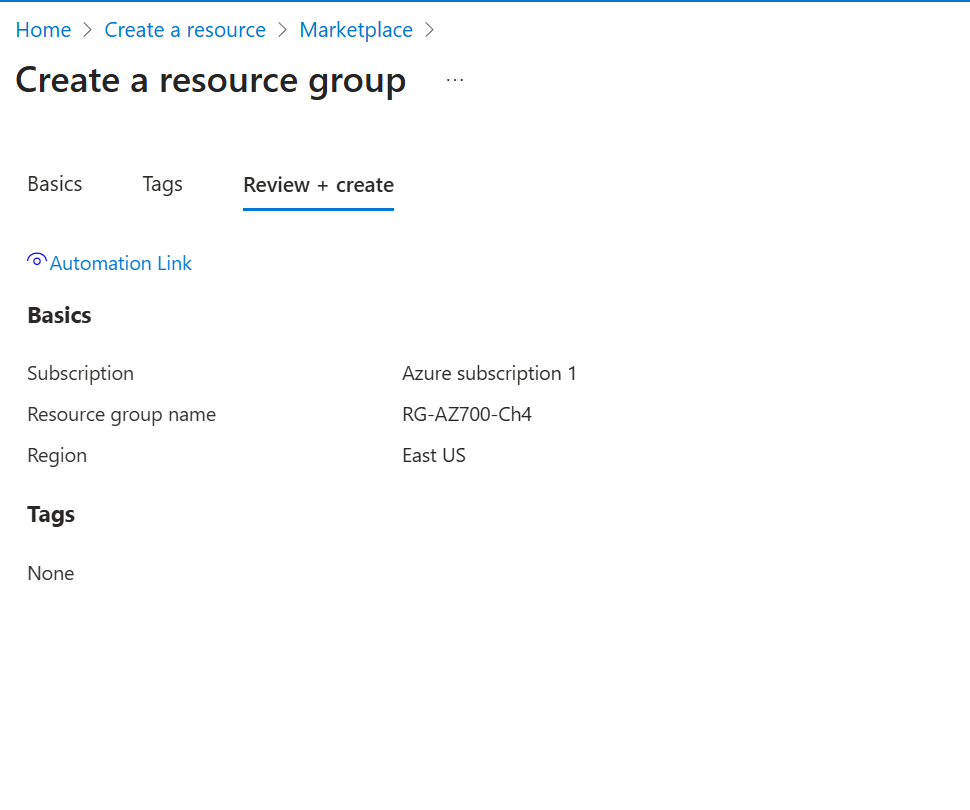
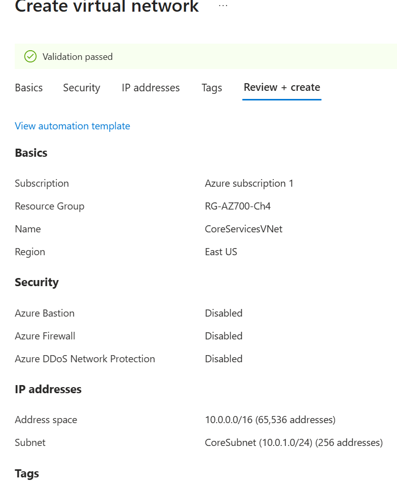
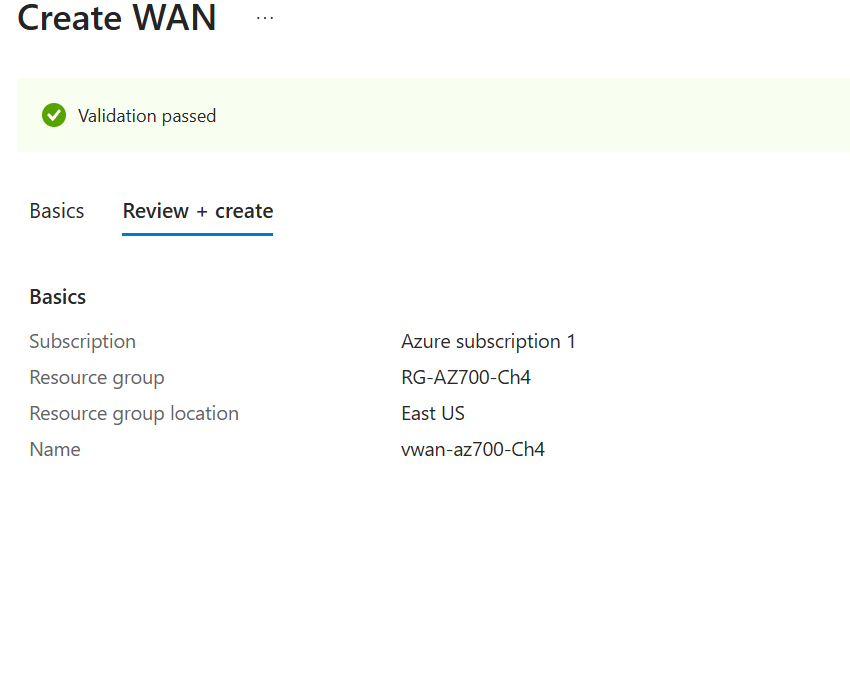
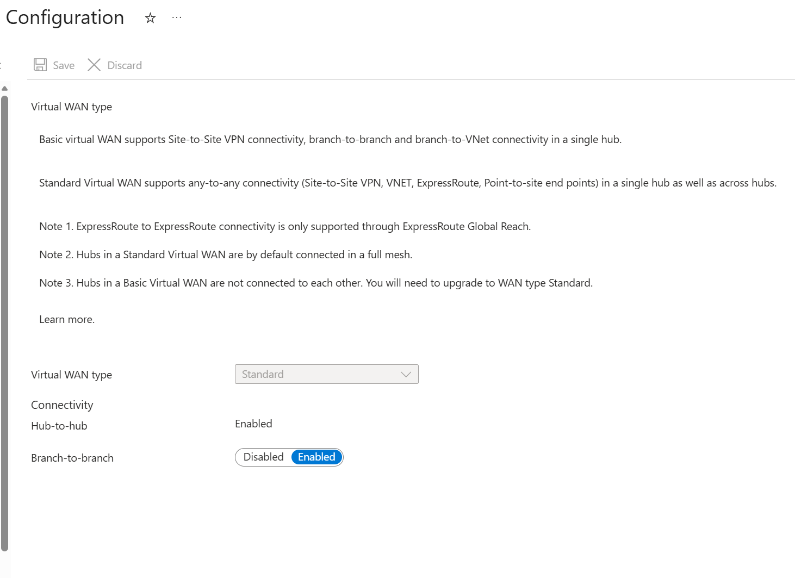
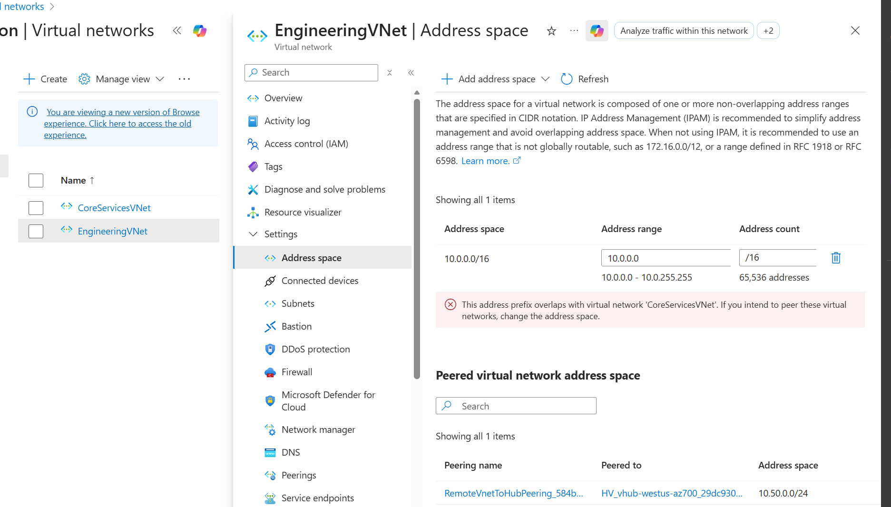
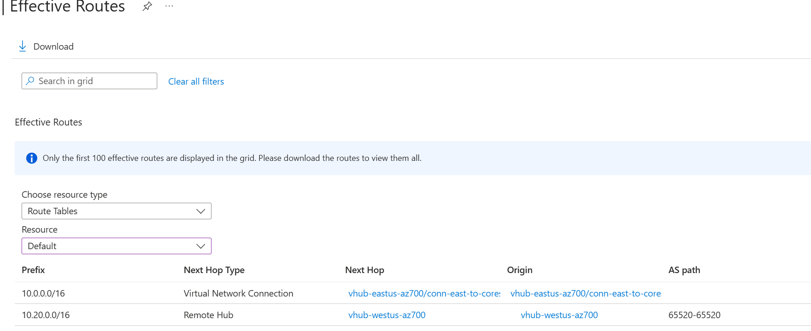
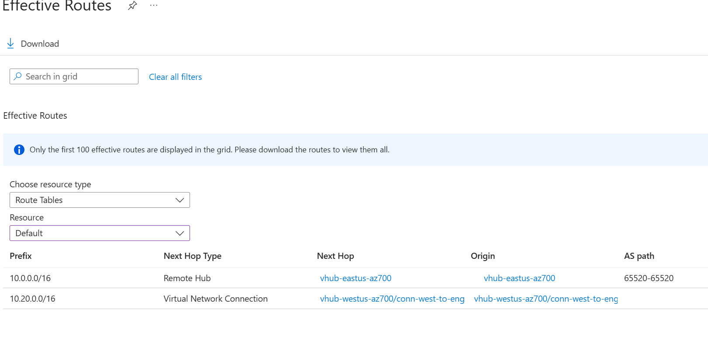
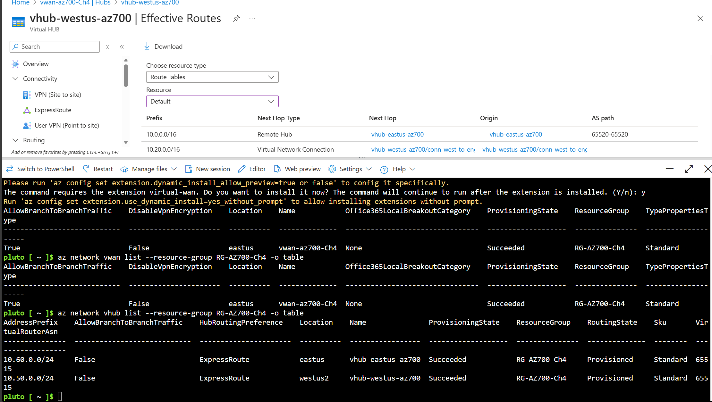
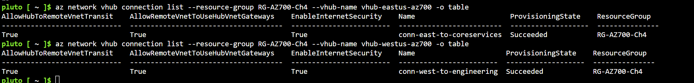
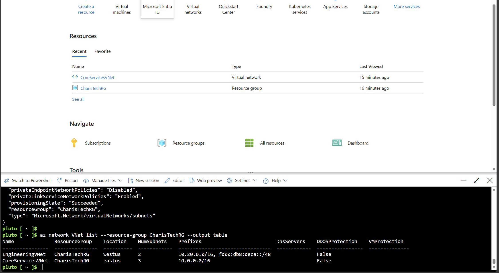

Traget Role: Azure Network Engineer
# AZ-700 — Design and Implement Cross-VNet Connectivity Using Azure Virtual WAN (vWAN)

## Overview
This lab demonstrates how to **design, deploy, and validate cross-VNet connectivity across regions using Azure Virtual WAN (vWAN)**.  
Instead of traditional VNet peering, this architecture uses **Microsoft-managed virtual hubs** to provide **centralized, scalable routing** between VNets.

The lab follows **enterprise Azure networking best practices** and directly aligns with **AZ-700: Designing and Implementing Microsoft Azure Networking Solutions**.

---

## What This Lab Teaches (At a High Level)

In real Azure environments, organizations often need to:
- Connect VNets across **multiple regions**
- Centralize routing and simplify network management
- Avoid complex mesh peering designs
- Prepare for **hybrid connectivity** (VPN / ExpressRoute)

This lab shows how **Azure Virtual WAN** solves those problems by acting as a **global routing backbone**.

---

## Architecture Concept (How Traffic Flows)

1. Each VNet connects to a **regional virtual hub**
2. Virtual hubs automatically exchange routes with each other
3. VNets learn remote routes dynamically through the hub
4. Traffic flows **VNet → Hub → vWAN backbone → Remote Hub → Remote VNet**

No manual route tables or VNet peering are required.

---

## Environment Summary

| Component | Details |
|---------|--------|
| Resource Group | `RG-AZ700-Ch4` |
| Virtual WAN | `vwan-az700-Ch4` (Standard) |
| Virtual Hub (East) | `vhub-eastus-az700` |
| Virtual Hub (West) | `vhub-westus-az700` |
| VNets | `CoreServicesVNet` (East US), `EngineeringVNet` (West US 2) |

---

## Step-by-Step Walkthrough

### Step 1 — Create a Dedicated Resource Group

A dedicated resource group is created to:
- Group all networking resources together
- Simplify management, cleanup, and cost tracking
- Reflect how production Azure environments are organized

---

### Step 2 — Deploy CoreServicesVNet (East US)

This VNet represents **shared or core services** typically found in enterprise environments.  
A `/16` address space is used to allow future growth.

**Key point:**  
Azure Virtual WAN requires **non-overlapping CIDR ranges** across all connected networks.

---

### Step 3 — Deploy EngineeringVNet (West US 2)

A second VNet is deployed in a **different Azure region** to simulate a real multi-region environment.

This allows us to validate:
- Cross-region routing
- Hub-to-hub connectivity
- Global traffic propagation

---

### Step 4 — Create Azure Virtual WAN (Standard)

The Virtual WAN is created using the **Standard SKU**.

**Why Standard matters:**
- Enables hub-to-hub connectivity
- Supports multi-hub architectures
- Required for enterprise routing scenarios

Basic vWAN would not support this design.

---

### Step 5 — Create the East US Virtual Hub

The East US virtual hub is created with its own **hub address space**.

Virtual hubs contain Microsoft-managed routers that:
- Learn routes from connected VNets
- Advertise routes to other hubs
- Eliminate the need for custom routing appliances

---

### Step 6 — Create the West US 2 Virtual Hub

A second hub is deployed to support regional routing and redundancy.

With multiple hubs:
- Traffic stays regional when possible
- Cross-region traffic uses Microsoft’s backbone

---

### Step 7 — Verify Virtual Hubs Are Active

This confirms:
- Both hubs are provisioned successfully
- The vWAN backbone is operational
- Routing infrastructure is ready

---

### Step 8 — Confirm vWAN Configuration

The vWAN is verified as **Standard** with **hub-to-hub connectivity enabled**.

This setting allows automatic route exchange between hubs without manual configuration.

---

### Step 9 — Address Space Overlap Validation

Azure detects and blocks overlapping CIDR ranges.

**Why this is important:**
- Overlapping IP space breaks routing
- IP planning (IPAM) is critical in enterprise networks
- vWAN enforces good design practices

---

### Step 10 — Connect VNets to Their Regional Hubs

Each VNet is connected to its closest virtual hub.

Once connected:
- VNets advertise their prefixes to the hub
- Hubs propagate routes across the vWAN backbone
- Cross-VNet communication becomes possible automatically

---

### Step 11 — Validate Effective Routes (CoreServicesVNet)

Effective Routes show what the VNet has actually learned.

This confirms:
- Routes from the remote region are present
- Traffic to EngineeringVNet will be forwarded to the hub

---

### Step 12 — Validate Effective Routes (EngineeringVNet)

This confirms **bi-directional routing**, which is required for application traffic to function correctly.

---

### Step 13 — View Routes from the West Hub Perspective

The hub view confirms:
- The hub is acting as a route exchange point
- Routes from both VNets are present
- vWAN is managing propagation automatically

---

### Step 14 — Azure CLI Validation (vWAN and Hubs)

Azure CLI is used to validate:
- vWAN state
- Virtual hub deployment
- Provisioning status

Engineers rely on CLI for automation and troubleshooting.

---

### Step 15 — Azure CLI Routing Validation

CLI confirms:
- Hub connections are active
- Effective routes match portal observations
- The network is fully operational

---

---

---
